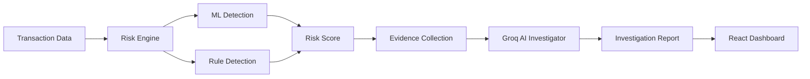

# AI Risk Investigator

An AI-powered financial transaction investigation platform that combines machine learning, rule-based risk detection, evidence collection, and LLM-powered analysis to investigate potentially risky transactions.


## Key Features

- ML-based transaction risk scoring
- Rule-based fraud and compliance detection
- Evidence-driven AI investigation using Groq
- Structured investigation reports
- PostgreSQL investigation history
- React dashboard for transaction analysis

## Tech Stack

### Backend
- Python
- FastAPI
- PostgreSQL
- SQLAlchemy
- Alembic
- Groq API

### Frontend
- React
- TypeScript
- Vite
- Tailwind CSS
- Recharts


## Architecture



## Investigation Flow

1. Transaction is selected.
2. ML and rule engines calculate risk signals.
3. Related evidence is collected.
4. Groq AI analyzes the evidence.
5. An investigation report is generated and stored.
6. Results are displayed on the React dashboard.

## Future Improvements

- **MCP:** Connect the investigator to external tools and data sources.
- **AI Agents:** Enable multi-step autonomous investigations.
- **Neo4j:** Analyze relationships between transactions, vendors, employees, and accounts.
- **Sentence Transformers:** Improve semantic evidence retrieval and similarity analysis.

## Running the Project

### Backend

```bash
cd backend
pip install -r requirements.txt
uvicorn app.main:app --reload

### Frontend

```bash
cd frontend
npm install
npm run dev
```

## Future Goal

The project will be expanded toward an autonomous AI investigation system using AI agents, MCP tools, Neo4j knowledge graphs, and semantic retrieval.