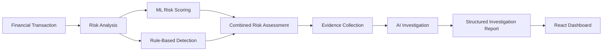
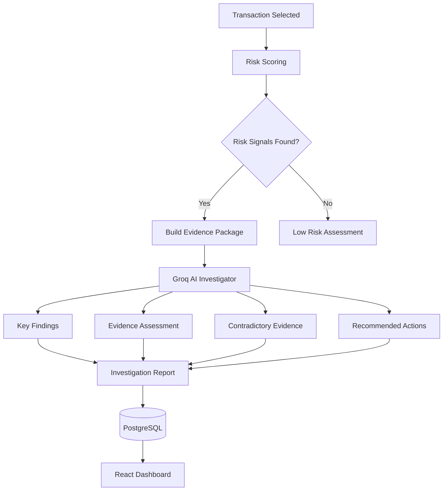
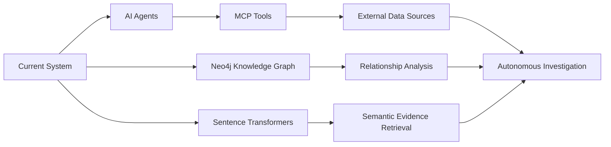

# AI Risk Investigator

An AI-powered financial risk investigation platform designed to analyze potentially risky financial transactions using machine learning, rule-based detection, evidence aggregation, and LLM-powered investigation.

The system helps transform raw transaction data into structured risk assessments by identifying suspicious signals, collecting related evidence, generating an AI investigation report, and presenting the results through a professional dashboard.

## What This Project Does




## Key Features

- **ML Risk Scoring** — Evaluates transactions using machine learning-based risk signals.
- **Rule-Based Detection** — Detects predefined fraud and compliance patterns.
- **Combined Risk Assessment** — Combines ML and rule-based scores into a final risk level.
- **Evidence Collection** — Gathers related transaction, invoice, vendor, employee, approval, account, and incident data.
- **AI Investigation** — Uses Groq LLM to analyze evidence and generate structured investigation reports.
- **Investigation History** — Stores completed investigations in PostgreSQL.
- **Professional Dashboard** — Provides transaction analysis and investigation history through a React interface.

## Investigation Workflow

```mermaid
sequenceDiagram
    participant U as User
    participant API as FastAPI
    participant R as Risk Engine
    participant E as Evidence Engine
    participant AI as Groq LLM
    participant DB as PostgreSQL

    U->>API: Select Transaction
    API->>R: Calculate Risk
    R-->>API: Risk Assessment
    API->>E: Collect Evidence
    E-->>API: Evidence Package
    API->>AI: Analyze Evidence
    AI-->>API: Investigation Report
    API->>DB: Save Investigation
    API-->>U: Display Results


## System Architecture

```mermaid
flowchart TB
    FE[React Frontend<br/>Dashboard] --> API[FastAPI Backend]

    API --> TX[Transaction APIs]
    API --> INV[Investigation Engine]

    INV --> RISK[Risk Engine]
    INV --> EVIDENCE[Evidence Builder]
    INV --> LLM[Groq LLM Investigator]

    RISK --> DB[(PostgreSQL)]
    EVIDENCE --> DB
    INV --> DB

    LLM --> REPORT[Structured Investigation Report]
    REPORT --> DB
    REPORT --> FE

### Backend

| Technology | Purpose |
|------------|---------|
| Python | Core backend development |
| FastAPI | REST API development |
| PostgreSQL | Transaction and investigation data |
| SQLAlchemy | Database ORM |
| Alembic | Database migrations |
| Groq API | LLM-powered investigation |

### Frontend

| Technology | Purpose |
|------------|---------|
| React | User interface |
| TypeScript | Type-safe frontend development |
| Vite | Frontend tooling |
| Tailwind CSS | UI styling |
| Recharts | Data visualization |
| Framer Motion | Subtle UI animations |


## Project Structure

```text
ai-risk-investigator/
│
├── backend/
│   ├── app/
│   │   ├── api/              # API routes
│   │   ├── core/             # Configuration
│   │   ├── db/               # Database setup and models
│   │   ├── investigation/    # Risk and AI investigation logic
│   │   ├── schemas/          # Pydantic schemas
│   │   └── main.py           # FastAPI application
│   │
│   └── alembic/              # Database migrations
│
├── frontend/
│   └── src/
│       ├── api/              # Backend API integration
│       ├── components/       # Reusable UI components
│       ├── layouts/          # Dashboard layout
│       ├── pages/            # Application pages
│       └── types/            # TypeScript types
│
└── README.md
```

## Core Investigation Pipeline



## API Overview

The backend provides APIs for:

- Transaction retrieval and analysis
- AI-powered transaction investigation
- Investigation history
- Individual investigation report retrieval
- Application and database health checks

Example investigation flow:

```text
GET Transaction
      ↓
Calculate Risk
      ↓
Collect Evidence
      ↓
Generate AI Investigation
      ↓
Store Investigation Report
      ↓
Display in Dashboard
```

## Running the Project

### 1. Clone the Repository

```bash
git clone https://github.com/aman-tamar/ai-risk-investigator.git
cd ai-risk-investigator
```

### 2. Backend Setup

```bash
python -m venv .venv
```

Activate the virtual environment:

```powershell
.venv\Scripts\Activate
```

Install dependencies:

```bash
pip install -r backend/requirements.txt
```

Configure your environment variables, including:

```text
DATABASE_URL=
GROQ_API_KEY=
GROQ_MODEL=
```

Run the backend:

```bash
uvicorn backend.app.main:app --reload
```

### 3. Frontend Setup

```bash
cd frontend
npm install
npm run dev
```

## Future Improvements

The project is designed to evolve toward a more autonomous and intelligent investigation platform.



### Planned Improvements

- **AI Agents** — Multiple specialized agents for evidence gathering, analysis, verification, and investigation planning.
- **MCP** — Connect agents with external tools, databases, APIs, and investigation resources.
- **Neo4j Knowledge Graph** — Model relationships between employees, vendors, accounts, transactions, invoices, and incidents.
- **Sentence Transformers** — Enable semantic search, similarity analysis, and improved evidence retrieval.
- **Autonomous Investigation** — Allow agents to perform multi-step investigations and decide which evidence should be analyzed next.

## Project Goal

The long-term goal is to transform AI Risk Investigator from a transaction analysis platform into an intelligent investigation system capable of reasoning over financial evidence, relationships, historical patterns, and external information.

## Author

**Aman Singh Tamar**

---

⭐ If you find this project interesting, consider starring the repository.